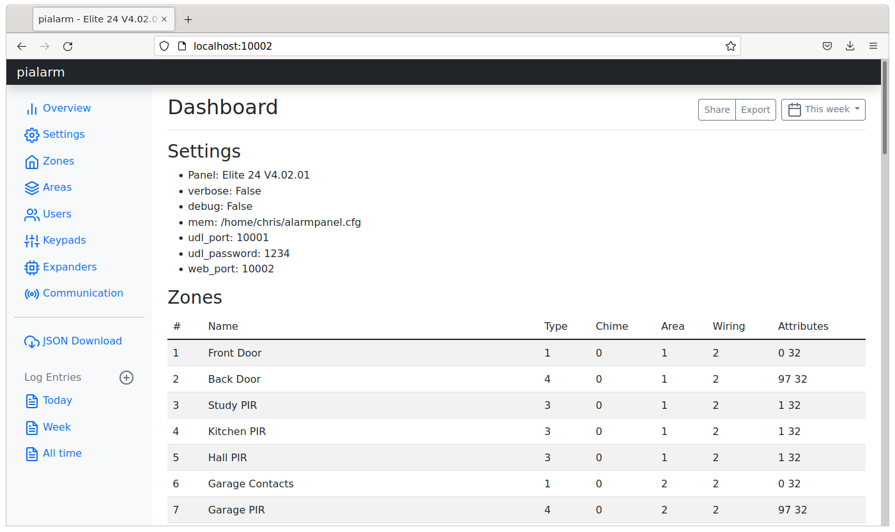

  

# pytexalarm

This repository contains python code to speak to (and impersonate) a Texecom alarm panel, via. the proprietary 'UDL protocol' over either UART serial or TCP ports. The project implements some of the functionality of Wintex, the manufacturer's windows-based configuration tool. It can dump the configuration from a panel, decode it and expose through a web browser.

## Quickstart - Reading config from panel over IP

You will need the *UDL Password* for the alarm system, and either a IPCom or SmartCom installed (or some 3rd party ser2net compatible device) on your local network:

    $ pip install pytexalarm
    $ python -m pytexalarm.udlclient --password MYPASSWORD --host 192.168.1.243 --mem home.panel
    $ python -m pytexalarm.webapp --mem home.panel

Then open up a web browser to http://localhost:8080 to view the panel config

> [!IMPORTANT]
> If you have a SmartCom and the panel is configured in *monitor mode*, then the UDL protocol is blocked from the local network. You need the 'engineers code' to change the Communications settings to the historic configuation of Com1:IPCom and Com2:Smartcom to fix this. See [this thread for details](https://texecom.websitetoolbox.com/post/wintex-connect-over-local-ip-to-smartcom-installation-13602490) on the Texecom Installers Forum.

## Advanced - Running a virtual panel

1. Install Wintex (on linux works well with playonlinux wrapper)
2. Setup a new 'Account' with these settings:

        Panel type:        Elite 24
        Software version:  4.x
        UDL password:      1234
        Network details:   127.0.0.1  port 10001

3. start `udl-server.py` running:

        $ git clone https://github.com/shuckc/pytexalarm.git
        $ cd pialarm
        $ python3 -m venv venv
        $ . venv/bin/activate
        $ pip install -r requirements.txt
        $ python udl-server.py
        Panel type 'Elite 24    V4.02.01' with UDL password 1234 backed by file /home/chris/alarmpanel.cfg
        Serving UDL on ('::', 10001, 0, 0), ('0.0.0.0', 10001)
        Serving web interface on 10002
        (eval) >

4. In wintex hit `Connect` -> `Connect via. Network (127.0.0.1 on Port 10001)`. Wintex will prompt to reset the fake panel. You will see some output like:

        udl_server 0: connected
        Sending login prompt
        Recieved UDL login [49, 50, 51, 52]. Sending panel identification
        Configuration read addr=00649b sz=10 data=0x2f,0xfc,0x56,0x50,0x85,0x90,0x48,0x44,0x76,0x11,0x43,0x39,0xce,0xc4,0x19,0x76
        Configuration read addr=005d04 sz=10 data=0x57,0x1,0x7,0x94,0x71,0x49,0x45,0x5,0x9f,0xea,0x6c,0xe7,0xe7,0x1b,0xa8,0x64
        Configuration read addr=001678 sz=1 data=0x0
        Configuration read addr=001fca sz=7 data=0x0,0x0,0x0,0x0,0x0,0x0,0x0
        Configuration read addr=00167e sz=1 data=0x0
        Configuration read addr=005c55 sz=2 data=0x0,0x0
        (eval) >

5. Open up a web browser to `http://localhost:10002` to see the decoded panel configuration

## Serial connection

It it not necessary to buy a SmartCom, Comm-IP, or Com300 board to use this software. You can use e.g. a FTDI USB-RS232 cable (5V), or with a breakout board and a few resistors, a FTDI 3.3V cable.

If your device has a built in hardware UART, e.g. a Raspberry Pi, this can be interfaced to the alarm panel with only a couple of resistors, plus a 12-15V DC to 5V DC power adapter to power it. In the [hardware](hardware/) directory you can see how to connect it to the Texecom main board.

> [!CAUTION]
> The TX line of the Texcom panel comms port is driven to +5V, which may exceed the allowable input voltage of some device's hardware UARTs. Ensure a pull-down resistor is used to limit the logic-high voltage to that required by your device. For more details, including the onboard serial resistor, see [hardware](hardware/).

The COM port does not need to be configured as any particular device, the panel allows UDL access on all unconfigured ports by default.

### Protocol

See captured examples and dissections of the ["simple" protocol](protocol/readme.md) and the [Wintex protocol](protocol/wintex-protocol.md).

### Legal
This project is not affiliated with Texecom. The protocols were reversed engineered using a Salae Logic8 logic probe, and later by capturing traffic using the `ser2net` tool, and custom scripts to convert trace files to memory maps. See the [protocol](protocol/) directory for these. For the fine details, a panel was emulated with `udl-server.py` and WinTex used to change settings individually. No author or contributor has signed the Texecom NDA agreement.

If you use the configuration system to change panel settings, this is done at your own risk. It is not beyond the realm of possibility that a panel might need NVM reset to recover or the use of a firmware flasher.

### See also

* Mike Stirling's @mikestir  implementation of an [Alarm Receiving Centre ARC](https://github.com/mikestir/alarm-server ), expecting messages over TCP, so requires e.g. ComIP communicator module
* @kieranmjones who first freely documented the [Cestron protocol](https://github.com/kieranmjones/homebridge-texecom/blob/master/index.js )
* @stuartyio who runs the Selfmon site for Honeywell panels
* Nexmo [text-to-speech](https://developer.nexmo.com/voice/voice-api/guides/text-to-speech) a very reliable and low cost way to send calls and SMS messages over IP
* [Telegram bot API](https://core.telegram.org/bots/api) for sending events to a chat group that can be setup on mobile phones.
* Gw0udm's [blog](https://gw0udm.wordpress.com/category/texecom/) which details serial port connectivity information as well as COM3 and various communicator systems.
* [Leo Crawford's brute forcing](https://www.leocrawford.org.uk/2019/01/10/brute-forcing-my-own-texecom-premier-elite.html) of the UDL login.
* RoganDawes' [ESPHome_Wintex](https://github.com/RoganDawes/ESPHome_Wintex) which can bridge Zone status to Home Assistant.
* RoganDawes' [Java WintexProtocol](https://github.com/RoganDawes/WintexProtocol) decoder
